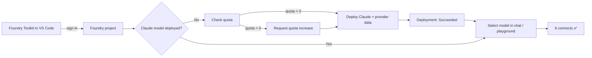

# How to Set Up a Claude Model in Microsoft Foundry via the Foundry Toolkit

A practical, battle‑tested guide for deploying an **Anthropic Claude** model into
**Microsoft Foundry** (Azure AI Services) and connecting it inside the **Foundry
Toolkit** (formerly *AI Toolkit*, *AITK*) for VS Code.

This guide was written after debugging a real `Model is not connected` error. It
focuses on the things that actually trip people up: **picking a real model name**,
**checking quota first**, and **the Anthropic provider‑compliance form**.

> ⚠️ **No secrets here.** Every subscription ID, resource name, project name, and
> email in this repo is a **placeholder** like `<SUBSCRIPTION_ID>`. See
> [Where to put your own values](#where-to-put-your-own-values) before you start.

---

## What you'll achieve



---

## Prerequisites

| Requirement | Notes |
|-------------|-------|
| VS Code + **Foundry Toolkit** extension | `ms-windows-ai-studio.windows-ai-studio` |
| **Azure CLI** (`az`) | `az --version` ≥ 2.60 |
| An **Azure subscription** | With rights to deploy Cognitive Services models |
| A **Foundry project** (AI Services resource, kind `AIServices`) | Create one from the Toolkit or [ai.azure.com](https://ai.azure.com) |
| Signed in | `az login` and signed into the Toolkit |

---

## Step 1 — Sign in to the Foundry Toolkit

1. Open VS Code → the **Foundry Toolkit** activity‑bar icon.
2. Sign in with the same identity that owns your Azure subscription.
3. Confirm `az` is pointed at the right subscription:

   ```powershell
   az account set --subscription "<SUBSCRIPTION_ID>"
   az account show --query "{name:name, id:id}" -o json
   ```

## Step 2 — Select (or create) your Foundry project

In the Toolkit, pick your project. It should resolve to an AI Services account, e.g.:

```
Project endpoint: https://<FOUNDRY_ACCOUNT_NAME>.services.ai.azure.com/api/projects/<PROJECT_NAME>
```

> 💡 If you have no project yet, run **Microsoft Foundry: Create Project** from the
> Command Palette and let it provision the AI Services resource.

## Step 3 — Find the **real** Claude model name (don't guess!)

> 🧨 **Root cause of most "Model is not connected" errors:** selecting a model name
> that doesn't exist (e.g. a misremembered codename). The Toolkit will happily
> *trigger* a deploy for a non‑existent name, then the chat instantly reports the
> model isn't connected because **there's no endpoint behind it**.

List the **actual** deployable Anthropic models for your resource:

```powershell
az cognitiveservices account list-models `
  --name "<FOUNDRY_ACCOUNT_NAME>" `
  --resource-group "<RESOURCE_GROUP>" `
  --query "[?format=='Anthropic'].{name:name, version:version, sku:skus[0].name}" `
  -o table
```

Use one of the **exact** names returned (for example `claude-sonnet-4-5`). The helper
script [`scaffold/list-claude-models.ps1`](scaffold/list-claude-models.ps1) does this for you.

## Step 4 — Check quota **before** deploying

The second most common blocker: the model exists, but your **quota limit is 0**, so
nothing can be deployed.

```powershell
az cognitiveservices usage list --location "<REGION>" `
  --query "[?contains(name.value,'claude')].{quota:name.value, used:currentValue, limit:limit}" `
  -o table
```

- **limit > 0** → you're good, go to Step 6.
- **limit = 0** → do Step 5 first.

The helper [`scaffold/check-claude-quota.ps1`](scaffold/check-claude-quota.ps1) scans
several regions at once and highlights any region that already has capacity.

## Step 5 — Request a quota increase (only if limit = 0)

Anthropic model quota often starts at **0** and must be raised by Microsoft. There is
**no self‑service** `Microsoft.Quota` path for these models — it goes through a
**support ticket** (exactly what the portal's *Request quota* button submits).

Two ways:

- **Portal:** [ai.azure.com](https://ai.azure.com) → your project → **Management center**
  → **Quota** → select your region + the Claude model → **Request quota**.
- **CLI scaffold:** see [`scaffold/request-quota.ps1`](scaffold/request-quota.ps1)
  (fill in your own contact details; it is opt‑in and confirms before sending).

Wait for approval, then re‑check Step 4.

## Step 6 — Deploy the Claude model

Anthropic deployments require a one‑time **provider‑compliance form**:
`industry`, `organizationName`, and `countryCode`. Without it you'll get:

```
InvalidModelProviderData: ModelProviderData is required for Anthropic model deployments
```

Deploy with the scaffold (recommended):

```powershell
# 1) Copy and fill in your values
Copy-Item scaffold/.env.example scaffold/.env
# edit scaffold/.env

# 2) Load them and deploy
scaffold/deploy-claude.ps1
```

Or do it directly with the REST body in [`scaffold/deployment-body.json`](scaffold/deployment-body.json):

```powershell
az rest --method put `
  --url "https://management.azure.com/subscriptions/<SUBSCRIPTION_ID>/resourceGroups/<RESOURCE_GROUP>/providers/Microsoft.CognitiveServices/accounts/<FOUNDRY_ACCOUNT_NAME>/deployments/<DEPLOYMENT_NAME>?api-version=2026-05-01" `
  --body "@scaffold/deployment-body.json" `
  --headers "Content-Type=application/json"
```

> 📌 **API version matters.** Use a version your region advertises (e.g. `2026-05-01`).
> A wrong one returns `NoRegisteredProviderFound` and lists the supported versions —
> just pick one from that list.

## Step 7 — Verify the deployment

```powershell
az cognitiveservices account deployment show `
  --name "<FOUNDRY_ACCOUNT_NAME>" `
  --resource-group "<RESOURCE_GROUP>" `
  --deployment-name "<DEPLOYMENT_NAME>" `
  --query "{name:name, state:properties.provisioningState, model:properties.model.name}" -o json
```

You want `"state": "Succeeded"`.

## Step 8 — Use the model in the Toolkit

1. Reload the Toolkit's model list (or restart VS Code).
2. Open the **Playground** or your **agent**, pick your `<DEPLOYMENT_NAME>`.
3. Send a prompt — it now connects to a live endpoint. ✅

---

## Troubleshooting

| Symptom | Likely cause | Fix |
|--------|--------------|-----|
| `Model is not connected` (instant) | Model name doesn't exist or isn't deployed | Step 3 + Step 6 |
| `InsufficientQuota` | Quota limit is `0` | Step 5 |
| `InvalidModelProviderData` | Missing Anthropic provider form | Provide `industry`, `organizationName`, `countryCode` (Step 6) |
| `NoRegisteredProviderFound` | Wrong `api-version` | Use a version from the error's supported list |
| `ResourceGroupNotFound` | `az` on the wrong subscription | `az account set --subscription <SUBSCRIPTION_ID>` |

> 🔎 The Toolkit's logs live in `~/.aitk/*.log`. Searching them for your model name and
> `not connected` quickly shows whether a deploy was even attempted against a real endpoint.

---

## Where to put your own values

**Nothing in this repo contains real credentials.** Supply your own:

1. Copy the template: `Copy-Item scaffold/.env.example scaffold/.env`
2. Edit `scaffold/.env` with **your** values:
   - `AZURE_SUBSCRIPTION_ID` — your subscription GUID
   - `FOUNDRY_RESOURCE_GROUP` — resource group of your Foundry account
   - `FOUNDRY_ACCOUNT_NAME` — your AI Services (Foundry) account name
   - `CLAUDE_MODEL_NAME` / `CLAUDE_MODEL_VERSION` — from Step 3
   - `ANTHROPIC_ORG_NAME` / `ANTHROPIC_INDUSTRY` / `ANTHROPIC_COUNTRY_CODE` — your org details
3. `scaffold/.env` is **git‑ignored** — it will never be committed.

🔐 **Security notes**
- Never hardcode subscription IDs, tenant IDs, or emails into scripts or commits.
- Prefer `az login` / managed identity over keys.
- Don't paste secrets into chat tools or issues.

---

## Repo layout

```
.
├── README.md                     # this guide
└── scaffold/
    ├── .env.example              # copy to .env and fill in YOUR values
    ├── list-claude-models.ps1    # find real Claude model names
    ├── check-claude-quota.ps1    # check/scan quota across regions
    ├── request-quota.ps1         # opt-in support-ticket scaffold
    ├── deploy-claude.ps1         # deploy a Claude model (verified path)
    ├── deployment-body.json      # REST body template (placeholders)
    └── main.bicep                # IaC alternative
```

## License

MIT — see [LICENSE](LICENSE).
